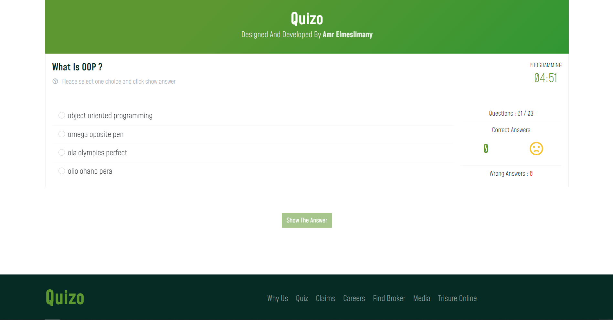

<h1 style="color:#5d9731">Quizo Site</h1>

This site I created for training on **OOP Js** for create small quiz with UI designing.

---

## List todo:

1. design landing page
2. handle responsive design for landing page
3. create questions type for quiz
4. create quiz page which contains the questions
5. create javascript code
6. create QUIZ class by using <b>OOP JS</b>
7. create Data.json file which contains questions for quiz
8. create modals and handle quiz page and finish app
9. deoploy the app on github

---

## Colors Used:

primary: <strong style="color:#5d9731">#5d9731</strong>
Secondry: <strong style="color:#052b24">#052b24</strong>
lightenPrimary: <strong style="color:#f2f7ef;background:#052b24;padding:2px 5px;">#f2f7ef</strong>
iconColor: <strong style="color:#58942b">#58942b</strong>

## Fonts

- NeuzeitGro
